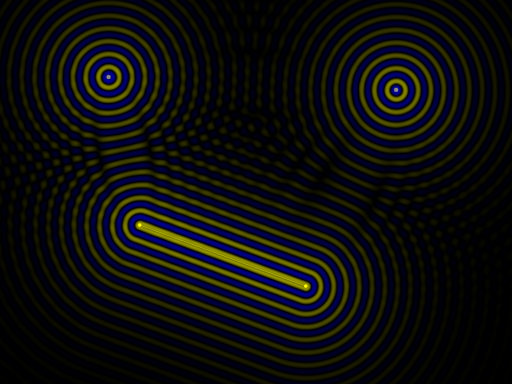

# fale

Interactive wave-interference simulator written in Rust. *Fale* means "waves" in Polish.

Place point sources and line sources on a canvas and watch circular and planar waves propagate, interfere, and decay in real time.



## Build & run

```bash
cargo run --release
```

Requires a working Rust toolchain. No external system dependencies beyond what `minifb` needs for your platform (on Linux, X11 or Wayland dev headers).

## Controls

### Mouse

| Action | Effect |
|--------|--------|
| Left-click empty space | Place a new point source |
| Left-click near a source | Select that source |
| Right-click drag & release | Draw a new line source |

### Keyboard

| Key | Effect |
|-----|--------|
| Up / Down | Increase / decrease frequency of selected source |
| Right / Left | Increase / decrease phase offset of selected source |
| M | Mute / unmute selected source |
| Delete | Remove selected source |
| C | Clear all sources |
| S | Save current frame to `fale.png` |
| Escape | Quit |

## How it works

Each source emits a wave whose amplitude at pixel `(x, y)` is:

```
A · exp(−decay · dist) · sin(2π · freq · (age − dist / speed) + phase)
```

The contribution is zero until the wavefront arrives (`age > dist / speed`). All source contributions are summed, passed through `tanh` to keep values in `[−1, 1]`, then mapped to a black-centred colour gradient (blue = negative, black = zero, yellow = positive).

The render loop runs at 60 fps. Per-pixel summation is parallelised across rows with `rayon`.

**Point sources** emit circular waves outward from a single pixel.
**Line sources** emit planar waves perpendicular to the segment, measured as distance-to-segment.

## Dependencies

| Crate | Purpose |
|-------|---------|
| `minifb` | Windowing and software framebuffer |
| `rayon` | Data-parallel row rendering |
| `image` | PNG export (`S` key) |
